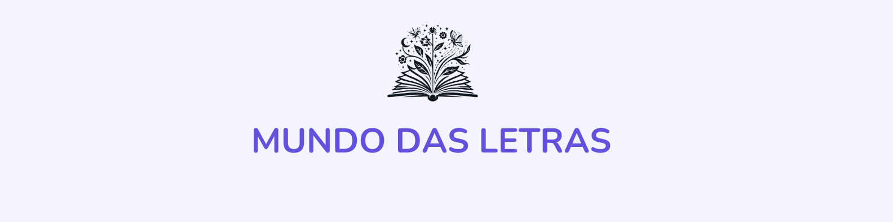
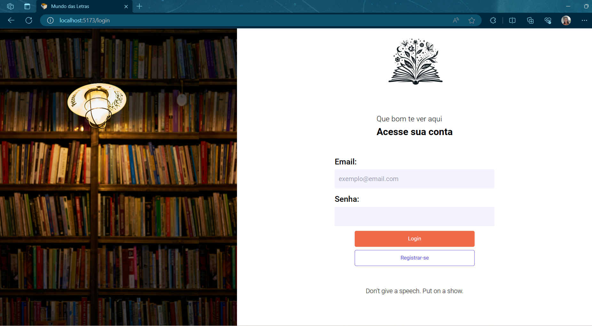

# Projeto final ADA

Este projeto é uma aplicação web de e-commerce construída com React para o projeto final do curso de Frontend da ADA em parceria com o Potência Tech.

## Páginas da Aplicação

- **Login / Cadastro:** os usuários podem criar uma conta ou fazer login para acessar a plataforma. 
    - **Rota:** '/login'
 
- **Home:** Exibe uma lista de livros que podem ser adicionados ao carrinho.
    - **Rota:** '/'

- **Detalhes do Livro:** Mostra informações detalhadas sobre um livro específico. 
    - **Rota:** '/details'

## Tecnologias utilizadas

**Front-end:** 
- React
- TypeScript
- CSS

**Back-end:** 

- JSON Server: *solução rápida e fácil para simular um backend RESTful API.*

## Funcionalidades

- **Login:** é necessário que o usuário realize o login para acessar as páginas Home e Details
- **Cadastro de usuários:** novos usuários podem se cadastrar e após o cadastro são redirecionados a página Home.
- **Inserir um item no carrinho¹**: ao clicar no botão de adicionar um item ao carrinho é adicionado um item no carrinho (ver demonstração).
- **Ver detalhes de um livro específico**: ao clicar na imagem do livro o usuário é direcionado para a página de detalhes que trará informaçõs específicas daquele livro. Além disso, nessa página terá o link do Preview do Livro e também o link para comprar o ebook do mesmo pela Google Play.

***¹Obs.:** Ao clicar em adicionar um item ao carrinho irá aparecer o número de itens adicionados ao carrinho. Não foi implementada a função de adicionar o item em si no carrinho e também não foi adicionado a página para visualizar os itens inseridos no carrinho.*

## Estrutura do Projeto

- `public/`: Este diretório contém imagens como a capa do projeto, ícones e imagens utilizadas no readme.

- `src/`: Este é o diretório principal.

  - `assets/`:

    - `images/`: Este subdiretório contém todas as imagens que são utilizadas no projeto. Isso inclui imagens usadas em componentes, páginas ou qualquer outro lugar na aplicação.

  - `components/`: Aqui você encontrará todos os componentes reutilizáveis que foram criados para a aplicação. 

  - `context/`: Este diretório contém o contexto global utilizado para o gerenciamento de estado da aplicação. 

  - `database/`: Aqui está o arquivo JSON que serve como banco de dados para armazenar a lista de usuários cadastrados. Este arquivo pode ser atualizado e consultado conforme necessário para manter e recuperar informações dos usuários.

  - `hooks/`: Este diretório contém hooks personalizados que foram criados para lidar com lógica específica da aplicação. 

  - `interfaces/`: Aqui estão localizadas as interfaces TypeScript que são utilizadas para definir a estrutura dos dados da aplicação.

  - `pages/`: Este diretório contém todas as páginas da aplicação, incluindo a página de login, a página inicial (home) e a página de detalhes do livro. Cada página é um componente React que corresponde a uma rota específica da aplicação.

  - `routes/`: Aqui estão localizadas as configurações das rotas da aplicação.

  - `styles/` : Este diretório contém estilos globais que são aplicados em toda a aplicação. Isso inclui estilos CSS que afetam a aparência e o layout de todos os componentes e páginas.

## APIs Utilizadas

- **Google Books API:** Utilizada para listar e detalhar os livros. Essa API permite listar e buscar dados relacionados a livros do Google Books, incluindo informações sobre autor, editor, número de páginas, descrições, preço, link para pré-visualização, link para compra do ebook na Google Play, entre outras.

- **Advice API:** Utilizada para apresentar um conselho aleatório na página de Login. Essa API fornece frases motivacionais e inspiradoras.

## Pré-requisitos

Node.js instalado (versão 12 ou superior).

## Rodando localmente

Clone o projeto

```bash
  git clone https://github.com/NanneSantin/projeto-final-ada
```

Entre no diretório do projeto

```bash
  cd mundo-das-letras
```

Instale as dependências

```bash
  npm install
```

Inicie o Json Server para simular o back end

```bash
  npx --watch json-server ./src/database/db.json
```

Inicie o projeto

```bash
  npm run dev
```

Acesse o link do localhost, realize o cadastro ou login e navegue pelas páginas. 🧭


## Demonstração


## Screenshots




## Autores

 

[@NanneSantin](https://github.com/NanneSantin)


